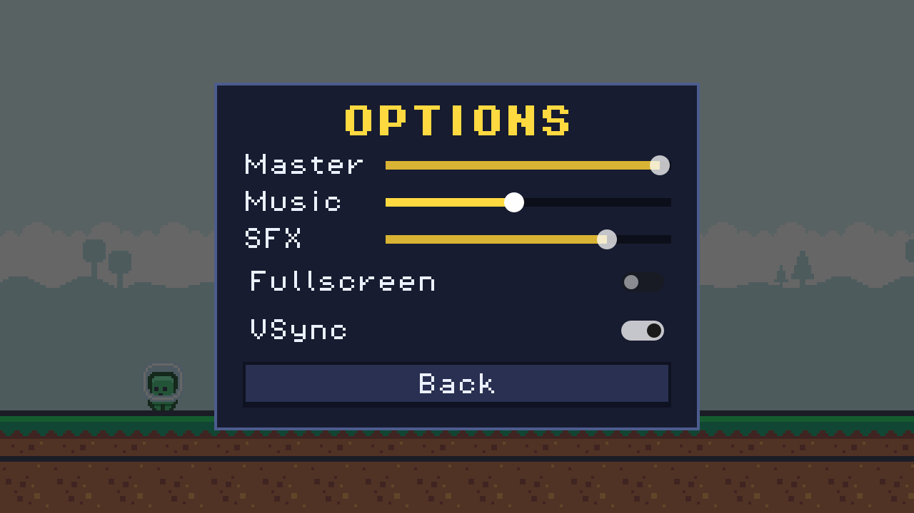

# Godot Menu System

A main menu, pause menu and options menu for Godot 4, with settings that are
saved to disk (volume per audio bus, fullscreen, vsync) and fade transitions
between scenes. Keyboard, mouse and gamepad all work.


## Features

- **Title screen** with Play, Options and Quit. Set the title and the scene Play
  opens in the Inspector.
- **Pause menu** with Resume, Restart, Options and Quit to Title. Esc, P or a
  gamepad's Start toggles it, and it pauses on its own when the window loses
  focus.
- **Options menu** with a volume slider per audio bus, plus fullscreen and vsync
  toggles. One scene, used by both the title screen and the pause menu.
- **Saved settings.** Everything is written to `user://settings.cfg` and applied
  again on the next launch.
- **Fade transitions** for every scene change, including Restart and Quit. They
  keep running while the game is paused or in slow motion, reset both when the
  new scene opens, and ignore a second request while a fade is running.
- **Keyboard and gamepad navigation.** Every menu focuses its first control when
  it opens, and focus goes back to where you were when a submenu closes.
- **Esc does the right thing.** Inside Options it closes Options; otherwise it
  toggles the pause.
- **One theme file** (`menus/menu_theme.tres`) styles every menu, with a crisp
  pixel font.

## Demo



The demo game is a character pacing back and forth and a clock counting up, so
you can see both freeze when you pause and start over when you restart. The music
and the click sound are made in code (`demo/demo_audio.gd`), so the sliders have
something to control without any audio files.

## Requirements

- Godot **4.7** or later, standard build (GDScript only, no .NET needed).
- Tested on **Godot 4.7.2 stable** on Windows. `Transition` waits for the
  `scene_changed` signal, which needs Godot 4.5 or later; earlier versions are
  untested.
- Uses the Compatibility renderer, so it runs on older GPUs too.

## Installation

Clone the repository:

```bash
git clone https://github.com/CodingQuests/godot-menu-system.git
```

Or download it with **Code > Download ZIP** and unzip it.

Then open Godot, click **Import**, pick the `project.godot` file inside the folder,
and click **Import & Edit**.

## Quick Start

1. Press **F5**. The title screen fades in with **Play** selected.
2. Use the arrow keys (or a gamepad) and **Enter**, or the mouse.
3. Open **Options**, drag the Music slider, and press **Esc** to go back.
4. Press **Play**, then **Esc** or **P** in the game to pause.
5. Close the game and start it again: your volumes are still there.

## How It Works

### Two autoloads

| Autoload | Script | Job |
|---|---|---|
| `Settings` | `menus/settings.gd` | Loads `user://settings.cfg`, applies it, saves it, and is where every menu reads and writes a setting |
| `Transition` | `menus/transition.gd` | A full-screen fade on its own top layer: `change_scene(path)`, `reload()`, `quit()` |

The demo adds a third, `DemoAudio`, which you will not need.

### Settings

Volumes are stored as 0.0 to 1.0, because that is what a slider gives you, and
converted to decibels for the mixer:

```gdscript
func set_volume(bus: String, linear: float) -> void:
	linear = clampf(linear, 0.0, 1.0)
	_config.set_value("audio", bus, linear)
	_apply_volume(bus, linear)   # AudioServer.set_bus_volume_db(idx, linear_to_db(linear))
	changed.emit()
```

`ConfigFile` writes a small text file you can open and read:

```ini
[audio]

Master=1.0
Music=0.5
SFX=0.8

[video]

fullscreen=false
vsync=true
```

Anything missing from the file (like on the very first launch) falls back to the
defaults at the top of `settings.gd`, and the next save writes every setting out.

### Pausing

`get_tree().paused = true` freezes every node whose process mode is the default,
Inherit. The pause menu, the options menu, and `Transition` set their process
mode to Always, so they keep running while everything else stops. Nothing in your
game needs to know the pause menu exists.

### Transitions

Trimmed a little (the error check is left out):

```gdscript
func change_scene(path: String) -> void:
	if _busy:
		return
	_begin()
	await _fade(1.0).finished        # cover the screen
	Engine.time_scale = 1.0          # don't carry slow motion or the pause along
	get_tree().paused = false
	get_tree().change_scene_to_file(path)
	await get_tree().scene_changed
	await _fade(0.0).finished        # reveal the new scene
	_end()
```

The fade's tween ignores the time scale, and the layer blocks mouse clicks while
it is covering the screen, so nothing can be pressed twice mid-fade.

## Project Structure

```
project.godot                 Project file, autoloads, the "pause" input action
default_bus_layout.tres       Master, Music and SFX audio buses
menus/settings.gd             Settings autoload: load, apply, save
menus/transition.gd           Transition autoload: fades between scenes
menus/main_menu.tscn/.gd      Title screen
menus/pause_menu.tscn/.gd     Pause menu
menus/options_menu.tscn/.gd   Options overlay, used by both menus
menus/menu_theme.tres         The look of every menu
demo/game.tscn/.gd            Demo only: a stand-in game with a pause menu in it
demo/backdrop.gd              Demo only: draws the sky and ground
demo/demo_audio.gd            Demo only: music and a click made in code
assets/fonts/                 Pixel Operator 8 (CC0)
assets/kenney_pixel-platformer/  Kenney Pixel Platformer art (CC0) and its license
```

## Using It In Your Own Game

1. Copy `menus/` and `assets/fonts/` into your project.
2. In **Project > Project Settings > Globals > Autoload**, add
   `menus/settings.gd` as `Settings` and `menus/transition.gd` as `Transition`.
3. Make sure your audio buses match `Settings.BUSES` (`Master`, `Music`, `SFX`), or
   edit the list. Copy `default_bus_layout.tres` if you have no buses yet.
4. Add a `pause` input action (this project maps Esc, P and gamepad Start).
5. Set `menus/main_menu.tscn` as the main scene, and set its `title` and
   `play_scene` in the Inspector. Replace its `Background` node with your art.
6. Instance `menus/pause_menu.tscn` in every scene that should be pausable.
7. Use `Transition.change_scene("res://...")` instead of
   `get_tree().change_scene_to_file()` anywhere you want a fade.

## Customizing It

- **Look:** open `menus/menu_theme.tres` to change fonts, sizes, colors and the
  button styles for every menu at once. To style your whole game the same way,
  set it in **Project Settings > GUI > Theme > Custom**.
- **Buttons:** the menus build their buttons in `_build()`. Add a line like
  `vbox.add_child(_button("Credits", _show_credits))` for a new one.
- **More settings:** add a getter and setter to `settings.gd` (copy
  `is_vsync` and `set_vsync`), and a row in `options_menu.gd`'s `_build()`.
- **A new volume slider:** add the bus in the Audio tab, then add its name to
  `Settings.BUSES` and `DEFAULT_VOLUME`.
- **The fade:** set `color` and `duration` on `transition.gd`.

## Known Limitations

- No key rebinding, resolution picker or language setting. The settings file and
  `Settings` are easy to extend for them.
- Fullscreen and vsync can do nothing while the game runs inside the editor's
  embedded game window. Run it in its own window (or export it) to see them.
- Settings save when Options closes, not while a slider is dragging. Quitting
  with Options open (with Alt+F4, say) loses the changes made in it.
- On the web, Quit is hidden and fullscreen depends on the browser.
- Running headless (for example in CI), Godot's dummy audio driver reports two
  leaked audio objects at exit because the demo music is still playing. A normal
  run does not.
- Tested on Godot 4.7.2 on Windows only.

## License

MIT for the code. See [LICENSE](LICENSE).

## Third-Party Assets

- The font is [Pixel Operator 8](https://www.dafont.com/pixel-operator.font) by
  Jayvee Enaguas, released under CC0 1.0.
- The character, ground tiles and sky are from
  [Pixel Platformer](https://kenney.nl/assets/pixel-platformer) by Kenney,
  released under CC0 1.0.

Details are in [THIRD_PARTY_ASSETS.md](THIRD_PARTY_ASSETS.md).

## Learn How It Works

Want to understand how this works instead of just copying it?

CodingQuests teaches you how to build systems like this step by step in Godot,
with interactive lessons and real projects.

- **[2D Roguelike: Capstone](https://codingquests.io/quests/2d-roguelike-capstone?utm_source=github&utm_medium=resource&utm_campaign=godot_menu_system)**
  builds a title screen, faded scene transitions and a pause menu, then wires the
  whole game loop together. The first 3 lessons are free.
- **[Capstone: Build the Whole Game](https://codingquests.io/quests/platformer-capstone?utm_source=github&utm_medium=resource&utm_campaign=godot_menu_system)**
  finishes a platformer with a music autoload, screen transitions, and a main
  menu, options and pause, including the three volume sliders. The first lesson
  is free.

Made by [CodingQuests](https://codingquests.io/?utm_source=github&utm_medium=resource&utm_campaign=godot_menu_system).
